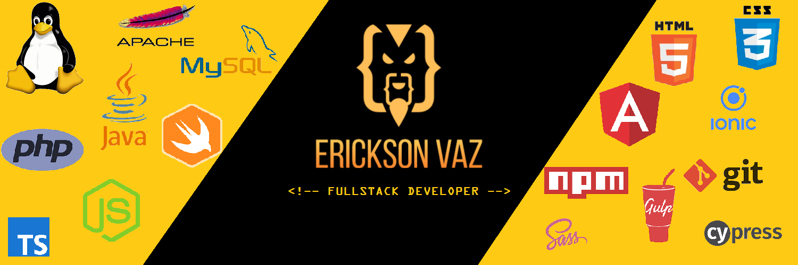

### Hello World 🤙

 

My name is Erickson. I am a software engineer, self-taught everytime, passionate about web, mobile and games development.
Professionally I work in the TIC area since 2018.

If you want to know a little more about my other works and projects that I am developing, visit my portfolio online at <strong>https://ericksonvaz.com</strong>

## 📌 Pinned Repositories

 

 
 

## &#x1f4c8; GitHub Stats

 
 

## 💼 Skills

More Skills

 

 

 

 
